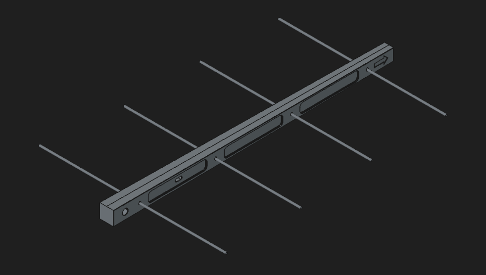

# 915-MHz-Yagi-Antenna
Directional antenna for 915 MHz, intended for use with Meshcore or Meshtastic, and possibly 4G connections.

# Bill of Materials

- 1.6mm Copper Rods
- SMA Coax with leads

# Tools

- NanoVNA for tuning
- Soldering Iron

# Assembly

